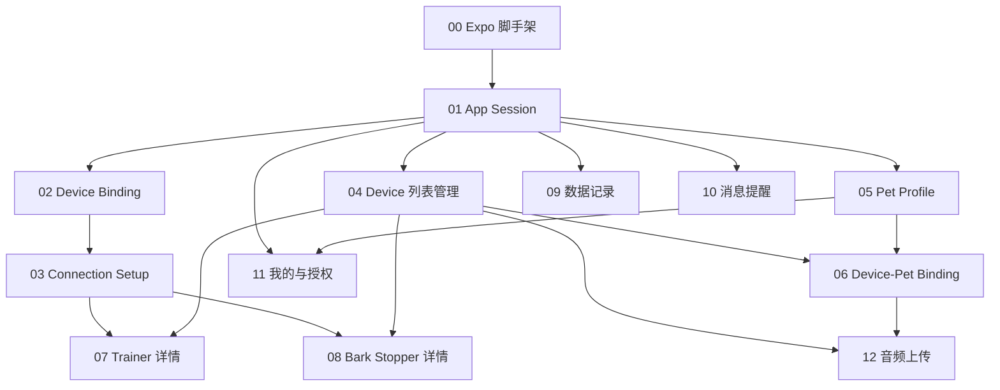

# SmartPet SenseLab App v1 — 任务总览

> 父任务 / 路线图。子任务见同目录下 `issue-*.md`。
> 标签：`ready-for-agent`（依赖已满足时可开工）

## 依赖关系

## 切片清单

| # | 标题 | 阻塞于 | 可演示结果 |
|---|------|--------|------------|
| 00 | Expo 脚手架与导航骨架 | — | App 能启动，5 Tab 壳 + 主题色 |
| 01 | App Session（邮箱登录） | 00 | 登录/退出，按设备数跳转 |
| 02 | Device Binding | 01 | 扫码/手输 SN 绑定成功 |
| 03 | Connection Setup | 02 | 蓝牙/Wi-Fi 入口，进详情 |
| 04 | Device 列表管理 | 01 | 列表、改名、解绑、进详情 |
| 05 | Pet Profile | 01 | 宠物档案增删改查 |
| 06 | Device-Pet Binding | 04, 05 | 设备关联宠物名称展示 |
| 07 | Trainer 详情与控制 | 03, 04 | 训犬控制 + 电击防误触 |
| 08 | Bark Stopper 详情 | 03, 04 | 止吠设置 + 吠叫闪烁 |
| 09 | 数据记录 | 01 | 吠叫/IMU 记录 + 筛选 |
| 10 | 消息提醒 | 01 | 消息列表 + 已读 |
| 11 | 我的与数据采集授权 | 01, 05 | 退出登录 + 授权开关 |
| 12 | 音频上传与重试队列 | 04, 06 | 批次上传失败可重试 |

## 建议开发顺序

**第一波（能跑通主流程）**：00 → 01 → 02 → 03 → 04

**第二波（宠物 + 设备能力）**：05 → 06 → 07 → 08

**第三波（数据与合规）**：09 → 10 → 11 → 12

## 后端可并行项（给你）

| App 切片 | 建议后端补齐 |
|----------|--------------|
| 01 | `POST /auth/register`, `login`, `refresh`, `logout`, `GET /me` |
| 02 | `POST /devices/bind`（按 SN 识别 device_type） |
| 04 | `GET/PATCH/DELETE /devices` |
| 05 | Pet Profile CRUD |
| 06 | Device-Pet bind/unbind/current |
| 07–08 | 设备指令上报、实时状态、止吠设置 |
| 09–10 | 记录与消息 API（或兼容接口） |
| 12 | Audio batch 创建/分片上传/完成 |

## 原型说明

UI 暂按现有 HTML 原型实现；视觉后续单独迭代，不阻塞以上切片。
